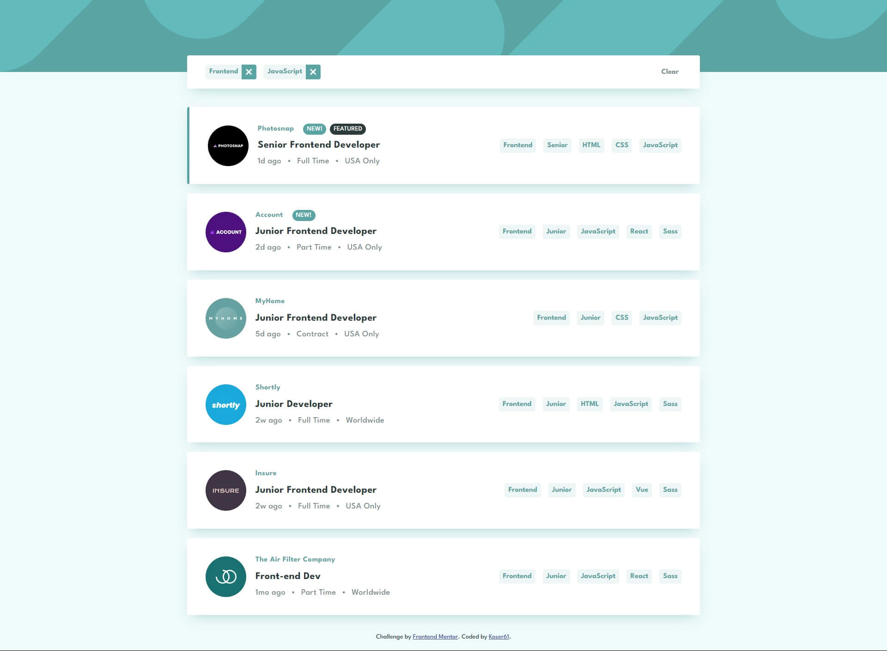

# Frontend Mentor - Job listings with filtering solution

This is a solution to the [Job listings with filtering challenge on Frontend Mentor](https://www.frontendmentor.io/challenges/job-listings-with-filtering-ivstIPCt). Frontend Mentor challenges help you improve your coding skills by building realistic projects. 

## Table of contents

- [Overview](#overview)
  - [The challenge](#the-challenge)
  - [Screenshot](#screenshot)
  - [Links](#links)
- [My process](#my-process)
  - [Built with](#built-with)
  - [What I learned](#what-i-learned)
- [Author](#author)

## Overview

### The challenge

Users should be able to:

- View the optimal layout for the site depending on their device's screen size
- See hover states for all interactive elements on the page
- Filter job listings based on the categories

### Screenshot



### Links

- Solution URL [here](https://www.frontendmentor.io/solutions/job-listings-with-filtering-react-Bkk_EdBBc)
- Live Site URL [here](https://helpful-starship-6b6a1e.netlify.app/).

## My process

### Built with

- Semantic HTML5 markup
- CSS3 (including Flexbox & CSS Grid features)
- JavaScript (ES6+)
- Mobile-first workflow
- [Create React App](https://reactjs.org/) - local environment toolchain
- [React](https://reactjs.org/) - JS library
- [SASS](https://sass-lang.com/) - CSS pre-processor (SCSS syntax)
- [Jest](https://jestjs.io/) - Testing framework
- [React Testing Library](https://testing-library.com/docs/react-testing-library/intro/) - React DOM testing utilities
- [Framer motion](https://www.framer.com/motion/) - React animation library

### What I learned

#### - Using useReducer hook for handling state changes

```js
export const initialFiltersState = {
  role: '',
  level: '',
  languages: [],
  tools: []
};

export const filtersReducer = (state, action) => {
  switch(action.type) {
    ...
    case 'ADD_LANGUAGE_FILTER':
      if(state.languages.includes(action.value)) {
        return state;
      } else {
        return {
          ...state,
          languages: [ ...state.languages, action.value ],
        };
      }
    case 'REMOVE_LANGUAGE_FILTER':
      const targetLanguageFilterIndex = state.languages.indexOf(action.value);

      return {
        ...state,
        languages: state.languages.filter((filter, index) =>
          index !== targetLanguageFilterIndex),
      };
    ...
    default:
      return state;
  }
};
...

const [ filters, dispatch ] = useReducer(filtersReducer, initialFiltersState);

...
```

#### - Using React Testing Library for writing unit tests

```js
describe('ClearButton component', () => {
  it('renders button with "Clear" text', () => {
    const fakeDispatch = jest.fn();

    render(<ClearButton dispatch={fakeDispatch} />);

    const button = screen.getByLabelText('clear filters');

    expect(button).toBeVisible();
    expect(button).toHaveTextContent('Clear');
  });

  it('dispatches proper action on click', () => {
    const fakeDispatch = jest.fn();
    const expectedActionObject = { type: 'CLEAR_FILTERS' };

    render(<ClearButton dispatch={fakeDispatch} />);

    const button = screen.getByLabelText('clear filters');
    fireEvent.click(button);

    expect(fakeDispatch).toBeCalledWith(expectedActionObject);
  });
});
```

## Author

- Github - [@p-kosinski](https://github.com/p-kosinski)
- Frontend Mentor - [@p-kosinski](https://www.frontendmentor.io/profile/p-kosinski)
